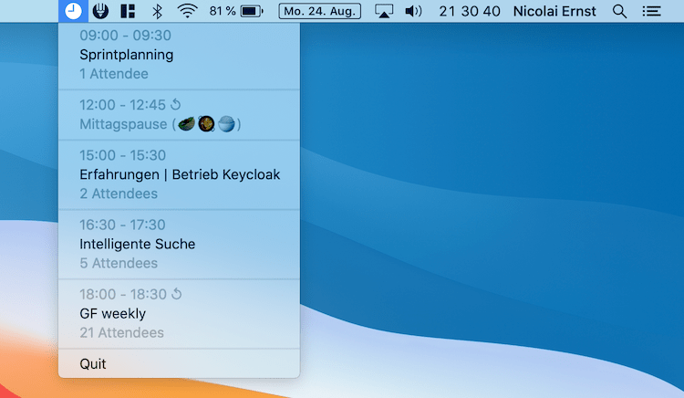

# meetings.

**meetings.** is a Mac app, that resides in the menu bar.

Given access to the calendar, it shows today's events from the `Exchange` calendar in a dropdown menu with the option, to join an attached Microsoft Teams meeting or Skype meeting by simply clicking on its name.

## Motivation

When working as a consultant, attending meetings is part of my daily job. I needed a simple app to quickly check, which meetings I have to join today. Further, a possibility to directly jump into the meetings, without having to open Microsoft Teams or Skype would save me a lot of time -- thus, this app was born.

## Installation

Download the app from the [release page](https://github.com/nicolai92/akai/releases/tag/1.1), unzip the file and copy it to the program's folder. You may find the app by its name *Meetings* then.

## Usage

When first launching the app, you may be asked to grant access to the calendar. This is necessary, to read today's events from the `Exchange` calendar. After that, the app resides in the menu bar and reveals the events by clicking on its icon (which is a clock icon).

If the event has a Microsoft Teams or Skype meeting attached, the name of the event is clickable and lets the user directly join the meeting. If there's no meeting attached, then the name of the meeting location is shown.

## Contributing

Pull requests are welcome ✌️ However, for major changes, please open an issue first to discuss what you would like to change.
